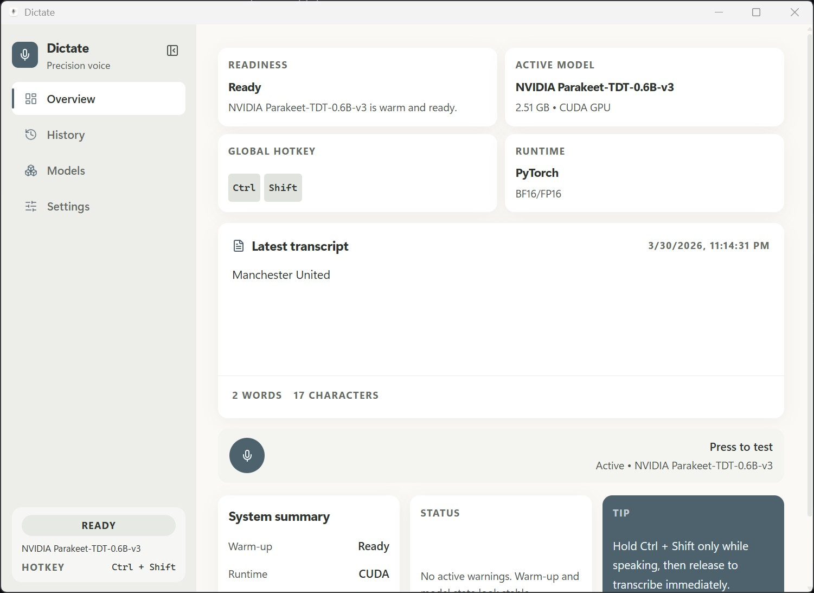
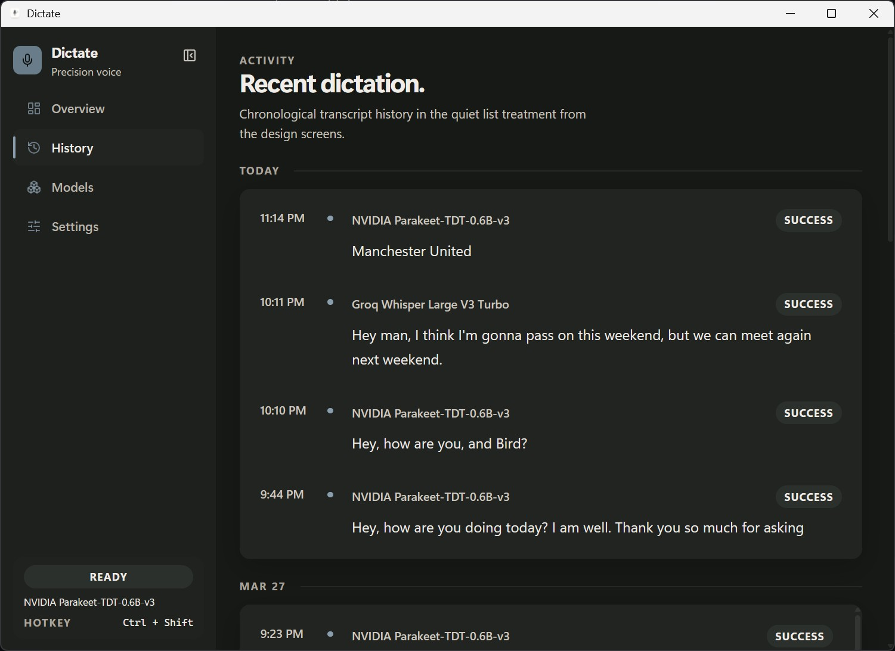
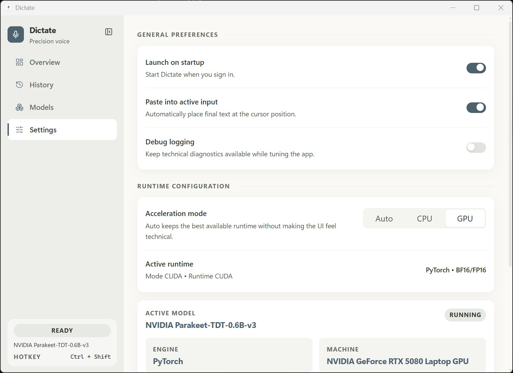

# Dictate

Minimal voice typing for desktop.

Hold `Ctrl+Shift`, speak, release, and Dictate transcribes locally into the active text field. The project is intentionally narrow: fast hold-to-talk dictation with clean model management, low-friction setup, and no extra workflow.

## Release Status

Dictate is currently in `beta` for its initial open-source release.

- Windows-first desktop app
- Windows-only release for now
- Linux build is planned shortly after the initial release
- macOS support will take longer
- Local CPU and cloud dictation are the most stable paths today
- Local NVIDIA GPU support is available, but still evolving
- TensorRT is planned, not shipped in the current build

## What It Is

Dictate is a Windows-first desktop app built with:

- Electrobun for the desktop shell
- React for the app UI
- A Python sidecar for speech recognition
- Local ASR models from Moonshine and NVIDIA
- Optional cloud transcription through Groq, Deepgram, AssemblyAI, and OpenRouter with bring-your-own API key flows

The app is designed around one primary interaction:

1. Focus any text box in any app.
2. Hold `Ctrl+Shift`.
3. Speak while the pill is visible.
4. Release the hotkey.
5. Dictate transcribes and auto-pastes the result.

## Current Scope

- Local, on-device transcription
- Optional Groq, Deepgram, AssemblyAI, and OpenRouter cloud transcription with saved local API key configuration
- Global hotkey: `Ctrl+Shift`
- Live pill overlay while recording
- Model download, warm-up, selection, and deletion
- Local and cloud model selection from the `Models` page
- CPU and NVIDIA CUDA runtime modes
- Recent transcription history
- Light and dark glassmorphism UI

## Screenshots

### Overview



### Models: Local


### Models: Cloud


### History



### Settings



## Usage

### App Setup

#### Install Dictate

1. Download the latest Windows canary installer `.exe` from GitHub Releases.
2. Run the installer.
3. Launch Dictate from the Start Menu or desktop shortcut.

#### First Launch

1. Open Dictate.
2. Go to `Models`.
3. Choose `Local` or `Cloud`.
4. For `Local`, install the model you want to use.
5. For `Cloud`, connect Groq, Deepgram, AssemblyAI, or OpenRouter with your API key and select a cloud model.
6. Keep `Acceleration mode` on `Auto` unless you specifically want to force `CPU` or `GPU`.
7. Set the model you want as default.

#### Local Setup Notes

- `Moonshine` models are the easiest local starting point and work without the NVIDIA path.
- NVIDIA local models require the `Dictate GPU runtime`.
- The Dictate GPU runtime uses your existing NVIDIA driver and GPU, but installs Dictate's own local Python packages under `%USERPROFILE%\.dictateapp`.
- On a fresh NVIDIA setup, preparing the Dictate GPU runtime can take roughly `4 to 5 minutes`.
- Settings shows a live progress bar while the Dictate GPU runtime is being prepared.
- Local models warm up after selection, especially larger NVIDIA models.
- Loading a local model into memory can take about `1 minute`, depending on the model and machine.
- The first local transcription can be slower while the selected model loads into memory and finishes warming up.
- Once warm, later local transcriptions are much faster.

#### Cloud Provider Setup

Groq:

- Get an API key from [Groq API Keys](https://console.groq.com/keys/)
- Groq docs overview: [Groq Docs](https://console.groq.com/docs/overview)

Deepgram:

- Create a key in [Deepgram Console](https://console.deepgram.com/)
- Deepgram docs home: [Deepgram Docs](https://developers.deepgram.com/home)
- New Deepgram accounts currently include `$200` of free credit: [Deepgram Pricing](https://deepgram.com/pricing)

AssemblyAI:

- Create a key in [AssemblyAI Dashboard](https://www.assemblyai.com/dashboard)
- AssemblyAI docs home: [AssemblyAI Docs](https://www.assemblyai.com/docs)
- AssemblyAI trial accounts currently include `$50` in free credits: [AssemblyAI Support](https://support.assemblyai.com/articles/5370767329-can-i-sign-up-for-free)

OpenRouter:

- Create a key in [OpenRouter Keys](https://openrouter.ai/settings/keys)
- OpenRouter docs home: [OpenRouter Docs](https://openrouter.ai/docs/overview)
- Dictate currently exposes one fixed OpenRouter speech model: `google/gemini-3.1-flash-lite-preview:nitro`

### Dictation Flow

1. Put the cursor in a text field.
2. Hold `Ctrl+Shift`.
3. Speak.
4. Release `Ctrl+Shift`.
5. Dictate transcribes and sends the text into the active field.

### What the UI Shows

- `Overview`: current model, runtime state, latest transcript, warnings, and readiness
- `History`: recent transcription jobs and outcomes
- `Models`: local vs cloud model source, install state, Groq, Deepgram, AssemblyAI, and OpenRouter connection state, and select/delete actions
- `Settings`: acceleration mode, appearance, paste behavior, and debug flags

## Models

### Local Models

| Model | Runtime | Size | Notes |
| --- | --- | --- | --- |
| `Moonshine Tiny Streaming` | CPU | `176 MB` | Fast fallback model for lower-end hardware |
| `Moonshine Medium Streaming` | CPU | `1.06 GB` | Balanced default for local CPU dictation |
| `NVIDIA Parakeet-TDT-0.6B-v3` | NVIDIA GPU | `2.51 GB` | Multilingual model with strong GPU accuracy |
| `NVIDIA Canary-Qwen-2.5B` | NVIDIA GPU | `5.12 GB` | Larger English model for stronger NVIDIA GPUs |

### Cloud Models

Cloud transcription is optional and uses your own provider API key.

| Provider | Model | Notes |
| --- | --- | --- |
| `Groq` | `whisper-large-v3-turbo` | Recommended default for cloud dictation: faster and lower cost |
| `Groq` | `whisper-large-v3` | Higher accuracy option with translation support |
| `Deepgram` | `nova-3` | Recommended Deepgram default for prerecorded BYOK dictation |
| `Deepgram` | `nova-2` | Deepgram compatibility fallback |
| `AssemblyAI` | `universal-3-pro` | Recommended AssemblyAI default for BYOK dictation with automatic `universal-2` fallback |
| `AssemblyAI` | `universal-2` | Standalone AssemblyAI fallback for broad language coverage |
| `OpenRouter` | `google/gemini-3.1-flash-lite-preview:nitro` | Fixed Gemini audio-input path through OpenRouter's Nitro routing |

## Runtime Modes

- `Auto`: prefers CUDA when a working CUDA sidecar runtime is available, otherwise falls back to CPU
- `CPU`: forces the CPU sidecar runtime
- `CUDA`: requests the CUDA sidecar runtime and warns if it is unavailable

Important:

- GPU models require compatible NVIDIA hardware.
- TensorRT is planned, but not shipped in the current build. NVIDIA models currently run on the PyTorch CUDA path.
- Local models require a warm-up step after launch or model changes.
- On a fresh NVIDIA setup, the Dictate GPU runtime can take roughly `4 to 5 minutes` to prepare.
- Local model loading can take about `1 minute` before the first transcription is ready.
- The first local transcription can be slower because the selected model has to load and warm up.
- The app shows warm-up state in the `Models` page for installed local models.

## Development Setup

### Prerequisites

- Bun
- Python 3 available on `PATH`
- PowerShell 7 on Windows
- Optional: NVIDIA GPU for CUDA acceleration

### Install

From the repository root:

```bash
bun install
pwsh -File dictate-app/sidecar/bootstrap.ps1
```

Optional CUDA runtime setup:

```bash
pwsh -File dictate-app/sidecar/bootstrap.ps1 -Runtime cuda
```

Optional setup for both CPU and CUDA runtimes:

```bash
pwsh -File dictate-app/sidecar/bootstrap.ps1 -Runtime both
```

### Run

Recommended development mode:

```bash
bun run dev:hmr
```

This starts:

- the Vite dev server for the React UI
- the Electrobun desktop process

## Quality Gates

From the repository root:

```bash
bun run typecheck
bun run lint
bun run build:canary
```

Windows release installer build:

```bash
bun run build:canary
bun run build:canary:installer
```

The maintainer-facing Windows installer is built with Inno Setup as a per-user install under `%LocalAppData%\Programs\Dictate`. The user-facing installer should be the generated `canary` installer `.exe`; Electrobun's canary payload remains the underlying app/update bundle.

## Data and Model Storage

By default, Dictate stores model assets under:

```text
%USERPROFILE%\.dictateapp
```

Key locations:

- Hugging Face cache: `%USERPROFILE%\.dictateapp\models\huggingface\hub`
- Moonshine cache: `%USERPROFILE%\.dictateapp\models\moonshine`
- Torch cache: `%USERPROFILE%\.dictateapp\torch`
- Cloud provider config: `%USERPROFILE%\.dictateapp\providers.json`

You can override the root with:

```text
DICTATE_HOME
```

App settings and transcription history are stored in the app user data directory in a local SQLite database. Groq, Deepgram, AssemblyAI, and OpenRouter BYO-key configuration is stored separately under `.dictateapp\providers.json`.

## Repository Layout

```text
dictate-app/
  src/
    bun/         Main process, hotkey handling, runtime orchestration
    mainview/    React UI
    shared/      Shared model catalog and RPC types
  sidecar/       Python transcription worker and runtime bootstrap
```

## Known Limitations

- Windows is the primary supported platform today.
- The current open-source beta release is Windows-only.
- Linux support is planned shortly after the initial Windows release.
- macOS support will take more time because platform-specific packaging, permissions, and runtime validation are still pending.
- This is a beta release, not a stable `v1`.
- Auto-paste is currently Windows-only and uses clipboard + `Ctrl+V`.
- `Launch on startup` is implemented on Windows via the current user's `Run` registry entry and opens tray-first on login.
- GPU acceleration depends on the installed sidecar runtime, CUDA availability, and compatible hardware.
- Local NVIDIA GPU support is still evolving and needs more real-world validation across drivers, CUDA environments, and hardware tiers.
- TensorRT is not available in the current build. A rollout plan exists in [docs/plans/2026-03-30-tensorrt-rollout-plan.md](D:/projects/dictate/docs/plans/2026-03-30-tensorrt-rollout-plan.md).
- Cloud provider flows depend on your own API key, provider account limits, and provider-side model availability.
- Windows packaging is split between the Electrobun canary app payload and the Inno Setup installer layer. Keep both paths in sync when changing release behavior.

## Contributing

The project is still being hardened for public collaboration. If you open issues or pull requests, include:

- Windows version
- CPU and GPU details
- selected model
- acceleration mode
- reproduction steps

## License

See [LICENSE](./LICENSE).
